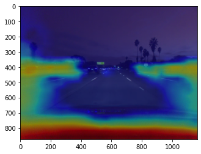
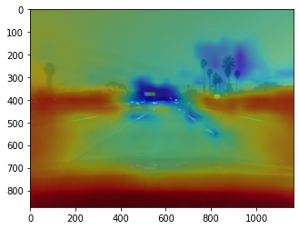

## [Check out the challenge's github repo](https://github.com/commaai/calib_challenge)

-------

This is an attempt at Comma ai's Calibration challenge with, DEEP LEARNING

The approach taken was to use a 7 layer convnet trained with PyTorch to predict yaw and pitch of the camera's motion.

The dataset consisted of 5 videos ~1min long recorderd at 20fps .
Which translates to about `5 x 60 x 20 = 6000` images.

In reality though, there were a little bit less than 6000 images as some frames taken when the car was 4m/s didn't have any pitch/ yaw recorded.
In my case, I removed every row that contained a NaN as I deemed them redundant.

Unlabeled videos were provided but for sanity sake, I splited the labeled videos into 80% training and 20% testing

The testing data would help to identify overfitting and determine overall generalization.

Because of the low data count, data augmentation was applied to improve the generalization of the model

As for image processing, I converted the images to grayscale and then downsampled the image by ~ 4 times.

As an extra sanity check, I decided to check the factors in the image that influenced the models predictions. I found it hard to believe the model would get such a low error without over fitting
The code for this is in `notebooks/Interpretability.ipynb`

Pitch Saliency map

Yaw Saliency map

The model seems to focus more on the lanes on the left and right side.
There are also large activations for the exposed part of the car interior.

But the initial finding kinda makes sense as the parallax point would have to start from those parts of the image

In the first visualization, there is an activation in what seems to be the parallax point of the road.

This challenge was really fun not gonna lie.

I started out with EDA checking the data and theninitially thought that applying deep learning techniques would be unfeasible because of the lack of data and the scale of the problem. Though the results were promising, I'm a bit sceptical on the generalization of the model as I can't validate on the unlabeled data.

I'm Really grateful to the Comma AI team for hosting this challenge.